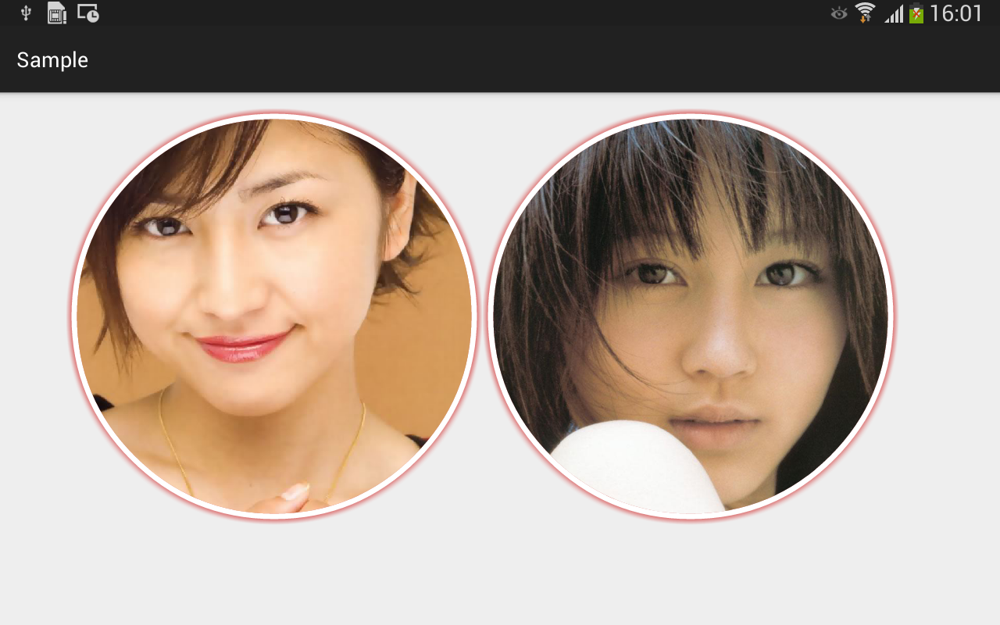

AvatarView
===

In most cases, we use a circle image view to display avatar, so why not just call it `AvatarView`.

In addition to the circle shape, `AvatarView` also provides an shadow around the circle.

Demo
---



Dependency
---

```groovy
compile "com.liangfeizc:avatarview:0.0.1@aar"
```

Attributes
---

* border_width
* border_color
* shadow_width
* shadow_color

Usage
---

```xml
<com.liangfeizc.avatarview.AvatarView
    android:src="@drawable/your_avatar_image"
    avatarview:border_width="10dp"
    avatarview:border_color="@android:color/white"
    avatarview:shadow_width="10dp"
    avatarview:shadow_color="@android:color/holo_red_dark"
    android:layout_width="200dp"
    android:layout_height="200dp" />
```

License
---

    MIT

